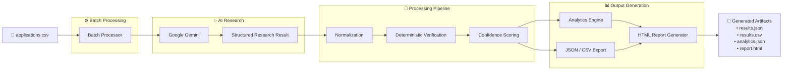

<p align="center">
  
</p>

<h1 align="center">🛠️ Tooling Intelligence</h1>

<p align="center">
<b>AI-powered SaaS Research, Verification & Analytics Platform</b><br>
Production-inspired pipeline that researches SaaS tools, validates integration metadata, generates analytics and produces a shareable HTML dashboard.
</p>

<p align="center">
  
  
  
  
  
  
</p>

---

# 🌐 Live Demo

| Resource | Link |
|----------|------|
| 📊 HTML Dashboard | https://ishita17tyagi.github.io/tooling-intelligence/ |
| 📝 Engineering Blog | https://behind-the-build.hashnode.dev/prompting-is-easy-engineering-reliable-ai-systems-isn-t |
| 🧠 Engineering Decisions | [ENGINEERING_DECISIONS.md](ENGINEERING_DECISIONS.md) |

> The HTML dashboard is generated from the latest sample batch execution included in this repository.

---

## 🚀 Start Here

If you're visiting this repository for the first time, here's the recommended order:

1. 🌐 Explore the Live Dashboard
2. 📖 Read the Engineering Blog
3. 🧠 Review the Engineering Decisions
4. 💻 Explore the source code

# 🚀 Overview

The project emphasizes **engineering reliable systems around LLMs**, not simply generating responses.

Rather than relying solely on prompt engineering, Tooling Intelligence combines deterministic verification, normalization, analytics, and reporting to produce trustworthy, explainable outputs from AI-generated research.

Given a list of applications, it automatically:

- 🔍 Researches official documentation using Google Gemini
- 📄 Extracts structured integration metadata
- 🧹 Normalizes inconsistent AI outputs
- ✅ Verifies responses using deterministic heuristics
- 📈 Generates confidence scores
- 📊 Produces analytics
- 📑 Creates an interactive HTML dashboard

The project emphasizes **engineering reliable systems around LLMs**, not simply generating responses.

---

# ✨ Features

- AI-powered SaaS research
- Batch processing pipeline
- Deterministic verification engine
- Confidence scoring
- Automatic normalization
- Analytics generation
- Interactive HTML report
- JSON & CSV export
- Graceful error recovery
- Manual review detection

---

# 📊 Sample Results

The repository includes a generated report for **10 real-world SaaS platforms**.

| Metric | Value |
|---------|------:|
| Applications Processed | **10** |
| Average Confidence | **99%** |
| Manual Review Queue | **0** |

Applications evaluated:

- Salesforce
- Zendesk
- Slack
- Google Ads
- Shopify
- DataForSEO
- GitHub
- Notion
- Stripe
- NotebookLM

---

# 🏗️ Architecture


### Pipeline Overview

1. Read SaaS applications from a CSV file.
2. Research each application using Google Gemini.
3. Normalize inconsistent LLM outputs.
4. Verify responses using deterministic heuristics.
5. Generate confidence scores and analytics.
6. Export structured JSON, CSV and an interactive HTML dashboard.

---

# 🧠 Verification Pipeline

Each research result is evaluated using deterministic scoring instead of relying on another LLM.

| Stage | Weight |
|--------|--------|
| Structural Validation | 40% |
| Evidence Validation | 35% |
| Completeness Validation | 25% |

Verification includes:

- Required fields validation
- Schema validation
- Official documentation checks
- Authentication validation
- Buildability validation
- Confidence scoring
- Manual review detection

---

# 💡 Engineering Decisions

Some key design choices:

- Built entirely in **Go** for simplicity, portability and performance.
- Uses **deterministic verification** instead of probabilistic evaluation.
- Introduces a **normalization layer** before analytics to improve consistency.
- Continues processing even if individual applications fail.
- Generates a **static HTML dashboard** from saved artifacts rather than relying on a running backend.

📖 Learn more about the architecture and design philosophy:

- **Engineering Retrospective:** [ENGINEERING_DECISIONS.md](ENGINEERING_DECISIONS.md)
- **Engineering Blog:** https://behind-the-build.hashnode.dev/prompting-is-easy-engineering-reliable-ai-systems-isn-t

---

# 📸 Screenshots

## Dashboard

<p align="center">

</p>

---

## Analytics

<p align="center">

</p>

---

## Batch Processing Logs

<p align="center">

</p>

---

## Batch API Response

<p align="center">

</p>

---

# 📂 Project Structure

```text
tooling-intelligence
│
├── cmd/
│   └── server/
│
├── internal/
│   ├── analytics/
│   ├── batch/
│   ├── config/
│   ├── gemini/
│   ├── handlers/
│   ├── models/
│   ├── normalizer/
│   ├── prompts/
│   ├── report/
│   ├── research/
│   ├── storage/
│   └── verification/
│
├── templates/
├── data/
│   ├── input/
│   └── output/
│
├── assets/
│
├── README.md
├── ENGINEERING_DECISIONS.md
├── go.mod
└── go.sum
```

---

# 📁 Generated Artifacts

Each batch execution generates:

```text
data/output/

analytics.json
results.json
results.csv
report.html
```

These artifacts become the source of truth for analytics, reporting and manual review.

---

# 🛠️ Tech Stack

| Layer | Technology |
|--------|------------|
| Language | Go 1.24 |
| LLM | Google Gemini |
| Templates | html/template |
| Data Storage | JSON + CSV |
| Verification | Deterministic Heuristics |
| Analytics | Custom Engine |
| Dashboard | HTML + CSS |

---

# ⚙️ Local Setup

Clone the repository

```bash
git clone https://github.com/<your-username>/tooling-intelligence.git

cd tooling-intelligence
```

Create a `.env` file

```env
GEMINI_API_KEY=YOUR_API_KEY
GEMINI_MODEL=gemini-flash-latest
PORT=8080
```

Install dependencies

```bash
go mod tidy
```

Run the application

```bash
go run ./cmd/server
```

---

# 🔄 Batch Processing

Update:

```text
data/input/applications.csv
```

Run:

```http
POST /batch
```

The pipeline automatically generates:

- `results.json`
- `results.csv`
- `analytics.json`
- `report.html`

---

# 🔮 Future Improvements

- Model Context Protocol (MCP) integration
- Multi-provider LLM support
- Concurrent worker pool
- Retry queue with exponential backoff
- Interactive charts
- Docker deployment
- User-supplied LLM API keys for self-hosted research
- Incremental batch execution
- Database-backed persistence

---

# 📄 License

MIT
