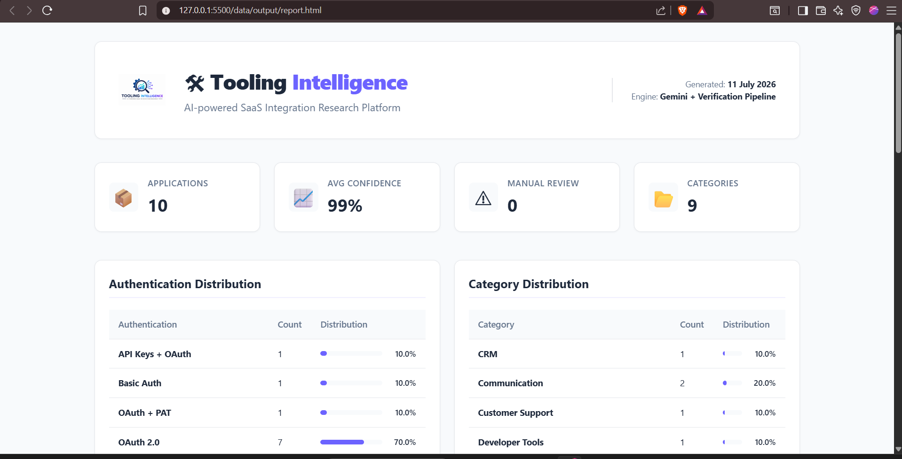
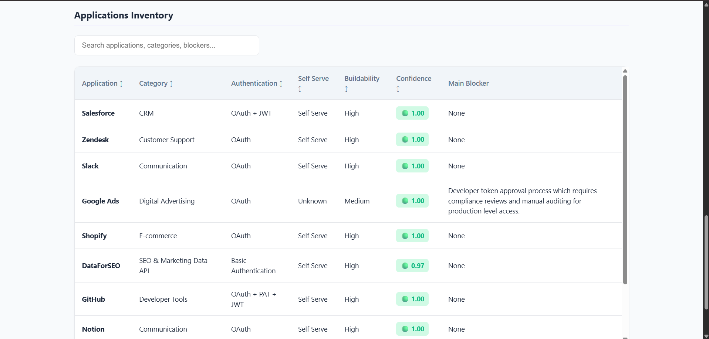
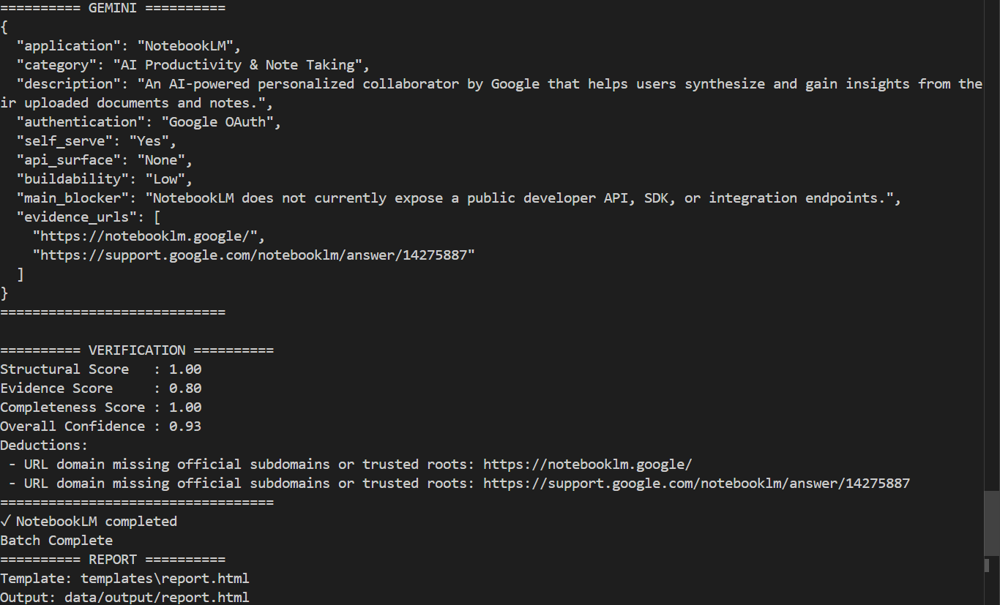
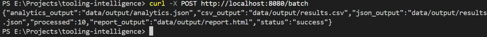

<p align="center">

</p>

<h1 align="center">Tooling Intelligence</h1>

<p align="center">
<b>AI-powered SaaS Research, Verification & Analytics Platform</b><br>
A production-inspired research engine that discovers, verifies and analyzes SaaS developer tools using Google Gemini and a deterministic verification pipeline.
</p>

<p align="center">


</p>

---

# 🚀 Overview

Tooling Intelligence is an AI-powered research platform that evaluates SaaS products from a developer integration perspective.

Given a list of applications, it automatically:

- researches official documentation
- extracts structured integration metadata
- normalizes inconsistent AI outputs
- performs deterministic verification
- generates confidence scores
- creates analytics
- exports a polished HTML dashboard

Unlike simple prompt wrappers, the project focuses on building a complete engineering pipeline around LLMs.

---

# ✨ Features

- AI-powered SaaS research using Google Gemini
- Deterministic multi-stage verification pipeline
- Confidence scoring
- Output normalization
- Batch processing
- JSON & CSV export
- Analytics generation
- Interactive HTML dashboard
- Graceful error recovery
- Manual review detection

---

# 📊 Sample Evaluation

The repository contains a generated report for **10 real-world SaaS platforms**.

| Application |
|-------------|
| Salesforce |
| Zendesk |
| Slack |
| Google Ads |
| Shopify |
| DataForSEO |
| GitHub |
| Notion |
| Stripe |
| NotebookLM |

### Generated Analytics

| Metric | Value |
|---------|------:|
| Applications | **10** |
| Average Confidence | **99%** |
| Manual Review Queue | **0** |

---

# 🏗 Architecture

```text
                 applications.csv
                        │
                        ▼
                Batch Processor
                        │
                        ▼
               Google Gemini Research
                        │
                        ▼
             Structured Research Output
                        │
                        ▼
                  Normalization
                        │
                        ▼
          Deterministic Verification
                        │
                        ▼
                Confidence Scoring
                        │
          ┌─────────────┴─────────────┐
          ▼                           ▼
    Analytics Engine             JSON / CSV
          │                           │
          └─────────────┬─────────────┘
                        ▼
             HTML Report Generator
```

---

# 🧠 Verification Pipeline

Confidence is calculated using deterministic heuristics instead of black-box evaluation.

| Stage | Weight |
|--------|---------|
| Structural Validation | 40% |
| Evidence Validation | 35% |
| Completeness Validation | 25% |

Verification checks include:

- Required fields
- Schema validation
- Authentication consistency
- Official documentation URLs
- Buildability
- Evidence quality
- Confidence scoring
- Manual review eligibility

---

# 💡 Engineering Decisions

The project intentionally favors deterministic engineering over prompt engineering.

Some important design choices include:

- Built entirely in Go for simplicity, static binaries and strong concurrency support.
- Normalization layer added before analytics to reduce LLM output variance.
- Deterministic verification instead of probabilistic evaluation libraries.
- Static HTML reports instead of a database-backed dashboard for portability.
- Batch execution continues even if individual applications fail.
- Analytics generated from structured artifacts rather than LLM summaries.

📖 A detailed write-up describing architecture decisions, trade-offs, challenges, testing strategy and future improvements is available in **[ENGINEERING_DECISIONS.md](ENGINEERING_DECISIONS.md)**.

---

# 📸 Screenshots

### Dashboard

> *(Add screenshot here)*



---

### Analytics

> *(Add screenshot here)*



---

### Batch Processing Logs

> *(Add screenshot here)*



---

### Batch API Response

> *(Add screenshot here)*



---

# 📁 Generated Artifacts

Running the batch pipeline automatically generates:

```text
data/output/

results.json

results.csv

analytics.json

report.html
```

---

# ⚙ Local Setup

Clone

```bash
git clone https://github.com/<username>/tooling-intelligence.git

cd tooling-intelligence
```

Create

```
.env
```

```env
GEMINI_API_KEY=YOUR_API_KEY

GEMINI_MODEL=gemini-flash-latest

PORT=8080
```

Install

```bash
go mod tidy
```

Run

```bash
go run ./cmd/server
```

---

# 🛠 Tech Stack

| Layer | Technology |
|--------|------------|
| Language | Go |
| LLM | Google Gemini |
| Templates | html/template |
| Storage | JSON / CSV |
| Analytics | Custom Engine |
| Verification | Deterministic Heuristics |
| Dashboard | HTML + CSS |

---

# 🔮 Future Improvements

- MCP integration
- Multi-provider LLM support
- Parallel research workers
- Retry queue
- Chart.js visualizations
- Docker deployment
- User-provided API keys
- Incremental batch execution
- API documentation
- Kubernetes deployment

---

# 📜 License

MIT